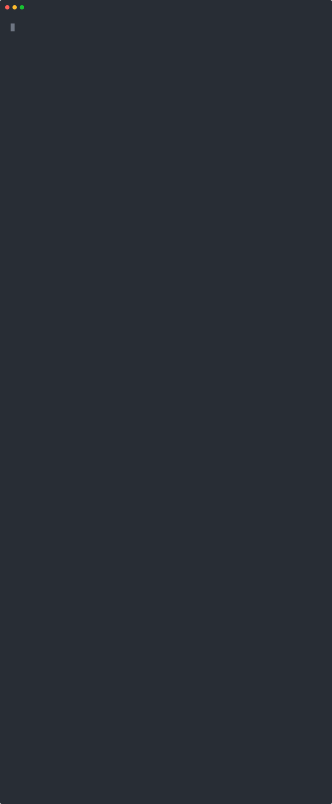

<p align="center">
  
</p>

# Candor

**Privacy-preserving proof-of-liabilities on [Midnight](https://midnight.network).**

An exchange or asset issuer proves on-chain that its reserves cover all customer liabilities, and
each customer privately verifies that their own balance is included in the total. Nothing
per-customer is written on chain: no names, no addresses, no amounts. An auditor reads only the
aggregate.

Built for the **Midnight Buildathon** (AKINDO WaveHack).

## How it works (three roles)

- **Issuer** — builds a Merkle-sum tree of customer balances and publishes `liabilities_root`,
  `declared_liabilities`, and `committed_reserves`. The contract asserts `reserves >= liabilities`
  and discloses only a `SOLVENT` boolean. Publishing is gated: the issuer proves in zero knowledge
  that it knows the secret behind a commitment fixed at deployment, so no one else can overwrite the
  published state.
- **Customer** — privately proves that their `(id, balance)` is a leaf under the published root *and*
  that the published total is the one the tree commits to. The balance itself is never revealed.
- **Auditor** — reads the public aggregate (`declared_liabilities`, `solvent`); nothing per-customer.

## Midnight integration

- Written in **Compact**, Midnight's privacy-enabled smart-contract language.
- **Dual-ledger:** public state (root, aggregate, solvency flag) vs. private witness (customer secret,
  balance, Merkle path). `disclose()` explicitly gates what leaves the private domain.
- **Private-by-default:** customer ids and balances stay in the witness; only the boolean solvency
  result and the aggregate become public.

## Scope & honesty about simplifications

- **[real]** Liabilities-side Merkle tree + private customer inclusion + selective disclosure — the core ZK work.
- **[simplified]** Reserves are an **attested/committed number** — proving on-chain control of reserve
  addresses is out of scope for a Compact circuit, and we say so plainly.
- **[real]** The tree is a Merkle-**sum** tree: every node hashes its subtotal alongside its children, so `declared_liabilities` is bound to the leaves. Restating the total moves the root, and every customer's check catches it.
- Inclusion lets a customer **detect** their own omission; it does not make omission impossible.
- **[known leak]** Merkle-sum has a cost, and we would rather state it than have it found. To fold
  their path, a customer receives the subtotal of each sibling subtree — and at the leaf level that
  sibling is a single other customer, whose balance they therefore learn exactly. Higher levels leak
  group aggregates. This is the problem DAPOL+ (eprint 2020/468) exists to solve, with blinded
  commitments and range proofs; doing it properly is a later wave. Until then: nothing leaks
  on-chain or to the public, but a customer holding a path learns something about their neighbours.

**Roadmap:** W1 single-issuer Merkle-sum tree + solvency boolean · W2 tree updates, revocation and a web UI · W3 cross-custodian nullifier.

## Repository structure

```
contract/src/candor.compact   the contract; `managed/` output lands beside it
src/                          off-chain code the issuer and customers run
  hash.ts                       persistentHash wrappers mirroring the circuit
  merkle-tree.ts                depth-8 liabilities tree + path extraction
  simulator.ts                  in-process CircuitContext harness
  demo.ts                       end-to-end walkthrough of all three roles
tests/                        inclusion / omission / solvency / aggregate
brand/                        logo & icon assets (PNG + SVG)
```

The Merkle depth is fixed at compile time — 8 levels, so 256 customer slots. Each node carries the
total of its subtree and hashes it in, which is what binds the published figure to the leaves: an
issuer holding an honest root cannot quietly declare a smaller number.

The off-chain builder in `src/` must hash identically to the circuit; `tests/candor.test.ts` pins the
two against each other via the contract's own `pure` circuits, because a one-byte divergence would
make every legitimate customer read as omitted.

### Telling a stale path apart from being dropped

`verify_inclusion` takes the root the caller built its path against and reverts if the ledger has
moved on. That distinction matters more here than it first looks.

Proving takes tens of seconds. If the issuer republishes in that window — say because another
customer joined — a path built a moment earlier no longer folds to the current root, and a customer
who is perfectly well included would be told they are not. On a solvency product that is not a
cosmetic bug: a false alarm either starts a panic or teaches people to ignore the alarm.

The obvious remedy is to accept recent roots as well, the way `HistoricMerkleTree` does. That would
be exactly wrong here — a customer who really was dropped would still verify against the root that
still listed them, which is the one thing this contract exists to catch. So a stale path reverts with
`stale root`, telling the client to refetch and retry, and only a mismatch against the *current* root
is reported as a red.

### Why not `merkleTreePathRoot`

The Compact standard library ships `merkleTreePathRoot` / `merkleTreePathRootNoLeafHash`, which
verify a witness path against a `MerkleTree` held in the ledger. Candor folds its own path instead,
for three reasons.

The stdlib helpers assume the tree lives on-chain and is checked with `tree.checkRoot()`. Candor
keeps the tree at the issuer and publishes only a root, so the number of customers and the shape of
each update stay off-chain. The on-chain type is also append-only, while an issuer republishes a
whole new tree each period rather than adding leaves to an old one.

Decisively, `merkleTreePathRoot` verifies membership and nothing else. Binding the declared total to
the leaves requires each node to hash its own subtotal, which that helper cannot express — so the
fold here is a requirement, not a preference.

## Setup & how to evaluate

Requires Node.js ≥ 22.15 and the Compact toolchain.

1. Install the Compact developer tools, then fetch the compiler:
   ```bash
   curl --proto '=https' --tlsv1.2 -LsSf https://github.com/midnightntwrk/compact/releases/latest/download/compact-installer.sh | sh
   ```
   ```bash
   compact update
   ```
2. Install dependencies and compile the contract:
   ```bash
   npm install && npm run compile
   ```
3. Run the test suite:
   ```bash
   npm test
   ```
4. Watch all three roles end to end:
   ```bash
   npm run demo
   ```

The demo walks an issuer publishing a root and four customers verifying privately, then two ways of
cheating and how each is caught. Drop one customer from the tree and she alone goes red. Keep every
customer but shave the declared total, and *everyone* goes red — that one is the Merkle-sum property
doing its work. It closes with the auditor's view and an insolvent publish being rejected by the
contract's own assert.

<p align="center">
  
</p>

Both the tests and the demo drive the **compiled** contract through `CircuitContext` in-process. They
exercise the real generated circuits rather than a TypeScript stand-in, but they do not generate ZK
proofs.

### Running it on a real network

For the full pipeline — build, prove, balance, submit, finalize — bring up a local devnet (node,
indexer, proof server) and deploy:

```bash
docker compose -f devnet.yml up -d
```
```bash
npm run devnet
```

That derives the dev-preset genesis wallet, deploys the contract, calls `publish_solvency`, reads the
resulting ledger back from the indexer, and calls `verify_inclusion` — every step with a real ZK
proof on chain. Proving dominates the wall clock: roughly 20 s for the deploy and 20–40 s per call.

`devnet.yml` binds all three services to `127.0.0.1` on purpose. The proof server sees private
witness data, and `docker -p` writes iptables rules that bypass ufw, so a bare `6300:6300` would
publish it on every interface of a public host.

Development is supported on Linux/macOS.

## License

[Apache-2.0](LICENSE). The Midnight-related code developed for the Buildathon is released under Apache-2.0.
